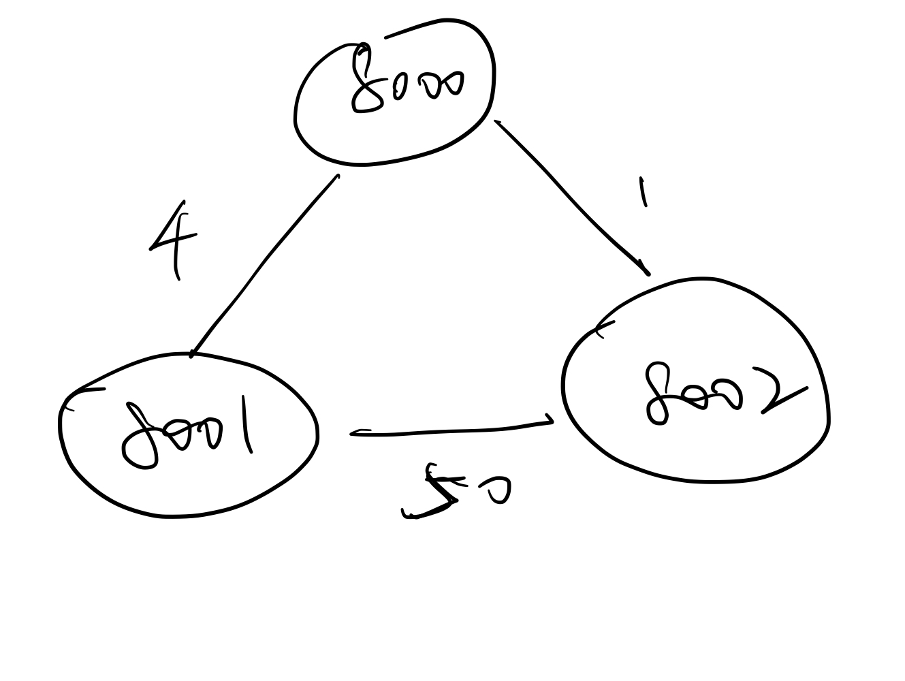
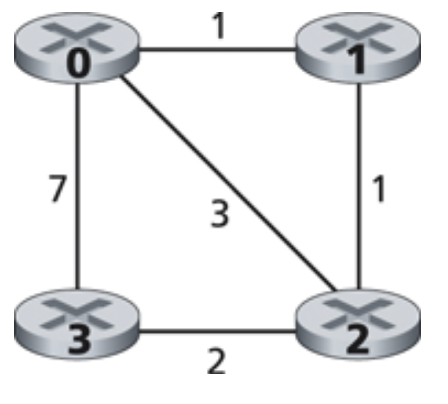

# Implementing a Distance Vector Routing Algorithm

There are two files: dvrouter.py and dvrouter_test_deploy.py. For dvrouter_test_deploy.py, it is a combination of both test and deploy. A more clean version is dvrouter.py

# Development step

## localhost test
### two host communication

```shell script
python dvrouter_test_deploy.py -p 8000 8001:2
```

```shell script
python dvrouter_test_deploy.py -p 8001 8000:2
```

### three host communication


```shell script
python dvrouter_test_deploy.py -p 8000 8001:4 8002:1
```

```shell script
python dvrouter_test_deploy.py -p 8001 8000:4 8002:50
```

```shell script
python dvrouter_test_deploy.py -p 8002 8000:1 8001:50
```

### four host communication


```shell script
python dvrouter_test_deploy.py -p 8000 8001:1 8002:3 8003:7
```

```shell script
python dvrouter_test_deploy.py -p 8001 8000:1 8002:1
```

```shell script
python dvrouter_test_deploy.py -p 8002 8000:3 8001:1 8003:2
```

```shell script
python dvrouter_test_deploy.py -p 8003 8000:7 8002:2
```

The test output will be in test/ folder

## CLIC test

### Configuring pycharm to use SSH interpreter

https://www.jetbrains.com/help/pycharm/configuring-remote-interpreters-via-ssh.html#ssh

This will 
1. auto sync with remote ssh system
2. use remote environment

### test with 4 host

change the main funtion of Node(mode) to deploy
```shell script
python3 dvrouter.py rome:1 paris:7 vienna:3
```

```shell script
python3 dvrouter.py berlin:1 vienna:1
```

```shell script
python3 dvrouter.py berlin:3 rome:1 paris:2
```

```shell script
python3 dvrouter.py berlin:7 vienna:2
```

Configure the test to 4 different domains